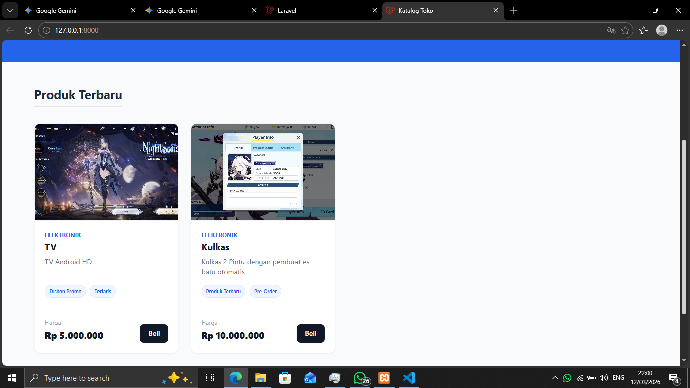
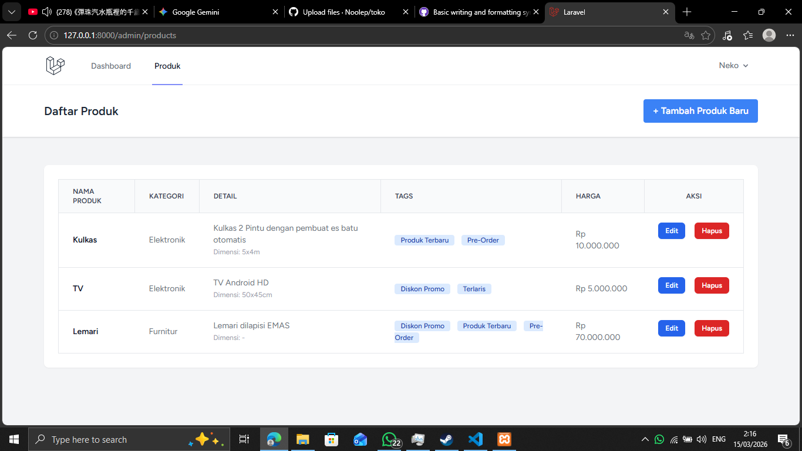

# Laravel E-Commerce: Admin Panel & Storefront

Sebuah sistem manajemen konten e-commerce *full-stack* yang dibangun menggunakan Laravel. Proyek ini mencakup Panel Admin yang aman untuk mengelola katalog produk, serta antarmuka publik (Storefront) yang responsif dan modern untuk pelanggan.

## 🚀 Fitur Utama

- **Otentikasi Aman:** Sistem *login* dan registrasi menggunakan Laravel Breeze.
- **Manajemen Produk (CRUD):** Tambah, edit, lihat, dan hapus produk beserta fitur *upload* gambar.
- **Relasi Database Kompleks:**
  - *One-to-One:* Detail Produk (Deskripsi & Dimensi).
  - *One-to-Many:* Kategori Utama Produk.
  - *Many-to-Many:* Sistem Label/Tags dinamis untuk filter produk.
- **Dashboard Statistik:** Ringkasan jumlah produk, kategori, dan tag secara *real-time*.
- **Storefront Publik:** Halaman etalase toko yang menarik menggunakan Tailwind CSS.
- **Database Seeder:** Otomatisasi pengisian data *dummy* (Kategori & Tag) untuk kemudahan *testing*.

## 🛠️ Teknologi yang Digunakan

- **Backend:** Laravel 12, PHP 
- **Frontend:** Tailwind CSS, Blade Templating
- **Database:** MySQL
- **Otentikasi:** Laravel Breeze

## ⚙️ Cara Instalasi (Local Development)

Jika Anda ingin menjalankan proyek ini di komputer lokal, ikuti langkah-langkah berikut:

1. **Clone repository ini:**
   ```bash
   git clone [https://github.com/Noolep/toko.git](https://github.com/Noolep/toko.git)
   ```
2. **Masuk ke direktori proyek:**
   ```bash
   cd toko
   ```
3. **Install dependensi PHP dan Node.js:**
   ```bash
   composer install
   npm install
   ```
4. **Siapkan file environment:**
   Copy file `.env.example` menjadi `.env`, lalu sesuaikan konfigurasi database Anda (pastikan Anda sudah membuat database kosong di MySQL).
   ```bash
   cp .env.example .env
   ```
5. **Generate Application Key:**
   ```bash
   php artisan key:generate
   ```
6. **Migrasi Database dan Jalankan Seeder:**
   Perintah ini akan membuat tabel dan mengisi data master (Kategori & Tags).
   ```bash
   php artisan migrate:fresh --seed
   ```
7. **Buat Symlink untuk Gambar Produk:**
   ```bash
   php artisan storage:link
   ```
8. **Jalankan Server:**
   Buka dua terminal dan jalankan perintah ini secara bersamaan:
   ```bash
   php artisan serve
   npm run dev
   ```
   Aplikasi sekarang dapat diakses melalui `http://localhost:8000.`
-------------------------------------------------------------------
## **📸 Gambar**

**Storefront Publik:**


**Panel Admin:**

  *By R*
   
